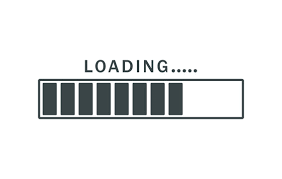

# Restaurant CSS Framework

## Description

Ce projet est une page web fictive pour un restaurant franchisé italien spécialisé dans la pizza.  
  
Le site web est responsive (pour les petits écrans et moyens) et comporter cinq pages accessibles : accueil, menu, photos, restaurants et contact.

## URL du site web

[l'URL de mon site web sera ajouter très prochainement 🤩]

## Détails des pages

### Accueil

- Une page avec un Jumbotron et deux panneaux pour afficher les actualités (promotions, événements, etc.).

### Menu

- Une page avec le menu du restaurant sous forme de liste groupée avec des badges.

### Photos

- Une page avec une galerie de minimum 10 photos et une pagination (3 photos par page).
- Images libres de droits.  
   https://www.pexels.com/fr-fr/

### Restaurants

- Une page sur les restaurants (il s'agit d'une franchise) avec les adresses, une carte et différents horaires.

### Contact

- Une page avec un formulaire de contact contenant :
  - Prénom
  - Nom de famille
  - Email
  - Sujet du message (une liste déroulante avec plusieurs options)
  - Une zone pour le message lui-même
  - Un bouton d'envoi avec une icône

Chaque entrée comprend un titre dans une balise sémantiquement appropriée.

## Crédits des images

- Toutes les images utilisées dans ce projet proviennent de sites offrant des images libres de droits, tels que [Unsplash](https://unsplash.com), [Pexels](https://www.pexels.com), et [Pixabay](https://pixabay.com). Veuillez consulter ces sites pour obtenir des images de haute qualité et libres de droits.

## Ressources

- [README](https://example.com)
- [Glyphicons](https://glyphicons.com)
